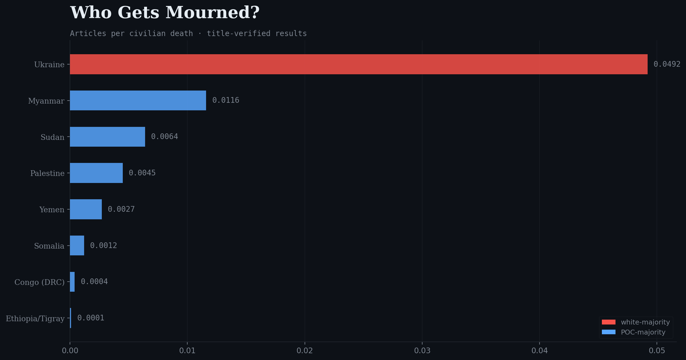
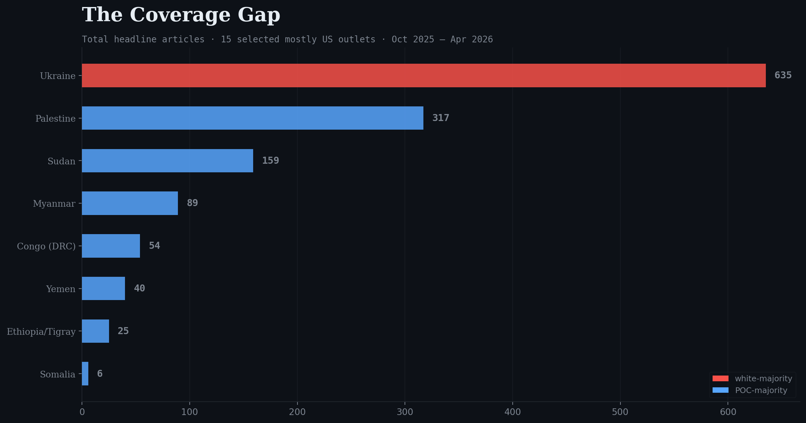
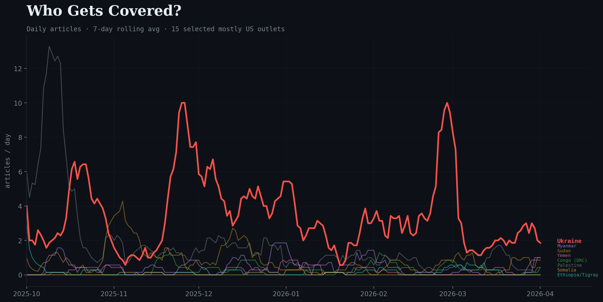
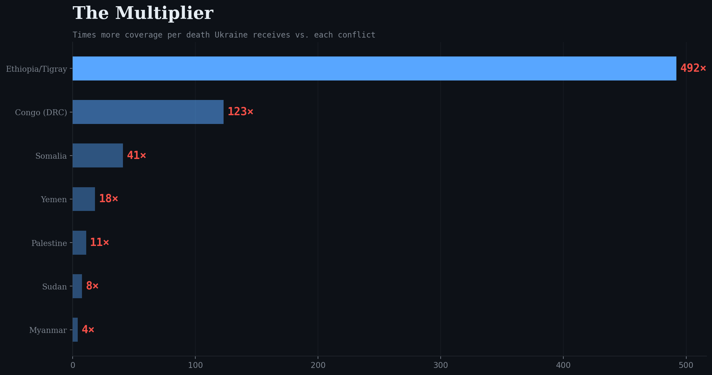
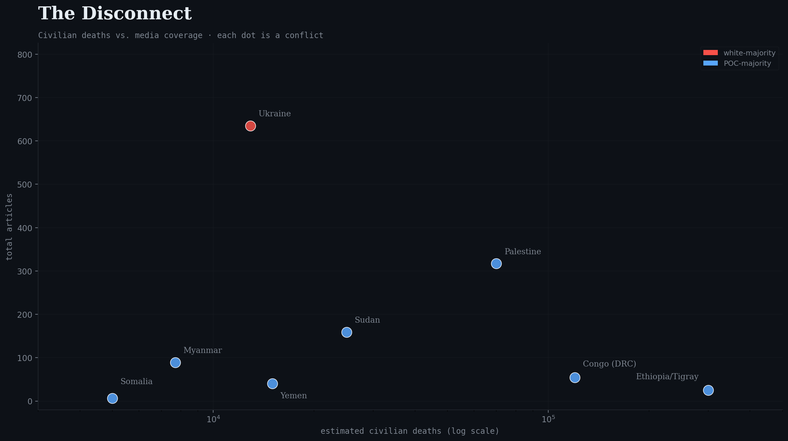

# THE COVERAGE GAP

### A Python analysis of headline-level conflict coverage across major English-language outlets

---

**How unevenly is headline attention distributed across conflicts when compared against estimated civilian deaths?**

This project compares headline-level coverage of eight armed conflicts across a fixed set of 15 major English-language outlets. Instead of asking only which conflict gets the most articles overall, it asks a more normalized question:

**How much headline attention does each estimated civilian death receive?**

Using MediaCloud article counts from a fixed outlet list that is **mostly US-based**, this project measures total headline coverage, coverage over time, and **articles per estimated civilian death** across conflicts in Ukraine, Palestine, Sudan, Myanmar, Yemen, Congo (DRC), Ethiopia/Tigray, and Somalia.

The result is a visible coverage gap. In this dataset, Ukraine receives far more coverage per estimated civilian death than every POC-majority conflict in the comparison set.



## What this project does

This repo collects article-count data from MediaCloud, limits the search to a fixed outlet list, and creates a set of charts that compare:

- total headline articles
- articles per estimated civilian death
- daily coverage over time
- the coverage multiplier between Ukraine and other conflicts
- estimated civilian deaths vs. total article volume

It is designed as a **clear, reproducible media-attention analysis**, not as a full content-analysis project.

## Scope of the analysis

### Outlet limit

Coverage is limited to these **15 English-language outlets**:

- CNN
- The New York Times
- Fox News
- BBC
- The Washington Post
- NBC News
- CBS News
- ABC News
- Associated Press
- Reuters
- USA Today
- NPR
- MSNBC
- Politico
- The Hill

In the code, these are enforced through canonical-domain filters, so the project is not measuring “all media.” It is measuring a **specific outlet set** that is mostly US-based, with BBC and Reuters included.

### Time window

The current dataset covers:

**October 1, 2025 to April 1, 2026**

That is a shared 6-month comparison window across all conflicts.

### Search strategy

This project uses **title-only queries** in MediaCloud.

That matters because it tries to count articles that are **actually about the conflict**, not articles that only mention it in passing. The collector uses `article_title:` terms built from conflict names plus words such as `war`, `killed`, `attack`, `civilian`, `casualties`, `conflict`, and similar case-specific terms.

Each conflict query is then combined with the fixed outlet-domain filter, so every conflict is measured with the same basic structure.

### Conflicts included

- Ukraine
- Palestine
- Sudan
- Myanmar
- Yemen
- Congo (DRC)
- Ethiopia/Tigray
- Somalia

For each conflict, the script stores:

- query terms
- region
- population label used for chart grouping
- estimated civilian-death benchmark

## Current benchmark values used in the code

The current collector script uses these normalization benchmarks:

- **Ukraine:** 12,910
- **Palestine:** 70,000
- **Sudan:** 25,000
- **Myanmar:** 7,700
- **Yemen:** 15,000
- **Congo (DRC):** 120,000
- **Ethiopia/Tigray:** 300,000
- **Somalia:** 5,000

These figures are used as **comparison benchmarks** inside the repo. They are not equally certain across cases, and they are not all measured in exactly the same way by outside sources. Some are based on relatively clear civilian tallies. Others are rougher public benchmarks used to normalize coverage across conflicts with very uneven reporting conditions.

## Civilian-death benchmark sources

These sources are included here so the benchmark values used in the repo are visible in one place.

| Conflict | Benchmark used in repo | Public source(s) | Note |
|---|---:|---|---|
| Ukraine | 12,910 | [OHCHR / HRMMU](https://ukraine.ohchr.org/en/2025-deadliest-year-for-civilians-in-Ukraine-since-2022-UN-human-rights-monitors-find) | OHCHR reported 12,910 civilian deaths since 24 Feb 2022 by the end of 2025. |
| Palestine | 70,000 | [UNRWA Situation Report #214 citing OCHA / Gaza MoH](https://www.unrwa.org/resources/reports/unrwa-situation-report-214-humanitarian-crisis-gaza-strip-and-occupied-west-bank), [OCHA snapshot](https://www.ochaopt.org/content/reported-impact-snapshot-gaza-strip-6-january-2026) | The script uses a rounded benchmark aligned with early-2026 publicly reported Gaza death totals. |
| Sudan | 25,000 | [EUAA Sudan security report](https://www.euaa.europa.eu/coi/sudan/2025/security-situation/11-overview-conflict/114-security-incidents-and-civilian-deaths-estimates), [OHCHR on rising civilian casualties](https://www.ohchr.org/en/press-releases/2025/09/sudan-crisis-deepens-amid-rising-civilian-casualties-growing-ethnic-violence) | Public estimates vary widely. This repo uses a rough benchmark rather than a universally accepted civilian-only total. |
| Myanmar | 7,700 | [OHCHR, Feb. 2026](https://www.ohchr.org/en/statements-and-speeches/2026/02/assistant-secretary-general-brands-kehris-myanmar-human-rights-and) | OHCHR said credible sources had verified the killing of more than 7,700 civilians since the 2021 coup. |
| Yemen | 15,000 | [CAAT summary using Yemen Data Project and ACLED](https://caat.org.uk/data/countries/saudi-arabia/the-war-on-yemens-civilians/), [CFR Global Conflict Tracker](https://www.cfr.org/global-conflict-tracker/conflict/war-yemen) | Yemen is difficult to compare cleanly because different sources report direct civilian deaths, direct conflict deaths, and wider war-attributable mortality separately. |
| Congo (DRC) | 120,000 | [CFR Global Conflict Tracker](https://www.cfr.org/global-conflict-tracker/conflict/violence-democratic-republic-congo), [UNICEF DRC humanitarian material](https://www.unicef.org/media/179311/file/2026-HAC-DRC.pdf) | DRC is one of the weakest benchmarks in the current repo. Treat it as provisional. |
| Ethiopia/Tigray | 300,000 | [peer-reviewed mortality estimate summary](https://pmc.ncbi.nlm.nih.gov/articles/PMC12096794/) | Published estimates for Tigray vary a lot. This repo uses a conservative comparison benchmark. |
| Somalia | 5,000 | [EUAA Somalia security report](https://www.euaa.europa.eu/sites/default/files/publications/2025-06/2025_05_EUAA_COI_Report_Somalia_Security_Situation.pdf), [UN protection of civilians report](https://reliefweb.int/report/world/protection-civilians-armed-conflict-report-secretary-general-s2024385-enarfrrueszh) | Somalia is also difficult because public sources often report incidents or regional tallies rather than one single cumulative civilian total. |

## Visualizations included

The analysis script currently generates these outputs:

- `output/total_coverage.png`
- `output/coverage_per_death.png`
- `output/coverage_multiplier.png`
- `output/timeline_comparison.png`
- `output/deaths_vs_coverage.png`
- `output/dashboard_data.json`

### Chart notes

- **The Coverage Gap** shows total headline article volume.
- **Who Gets Mourned?** shows articles per estimated civilian death.
- **The Multiplier** shows how many times more coverage per death Ukraine receives than each other conflict.
- **Who Gets Covered?** shows daily coverage over time using a 7-day rolling average.
- **The Disconnect** plots estimated civilian deaths against total article volume.









## Project structure

This repo follows this workflow:

### `01_collect_mediacloud.py`

Collects data from the MediaCloud API.

It:

- defines the fixed outlet list
- defines the conflict-specific title queries
- requests count-over-time data
- calculates total article counts
- calculates articles per estimated civilian death
- saves timeline data and article-count summaries
- fetches article samples for basic validation

### `02_analyze.py`

Reads the collected CSV files and generates the charts and JSON export.

It:

- loads `data/article_counts.csv`
- loads `data/coverage_over_time.csv`
- computes Ukraine-to-other-conflict coverage multipliers
- generates all figures
- exports `output/dashboard_data.json`

## Output structure

The repo is easiest to understand if it is organized like this:

```text
the-coverage-gap/
├── 01_collect_mediacloud.py
├── 02_analyze.py
├── README.md
├── requirements.txt
├── data/
│   ├── article_counts.csv
│   ├── coverage_over_time.csv
│   └── articles_sample.csv
└── output/
    ├── total_coverage.png
    ├── coverage_per_death.png
    ├── coverage_multiplier.png
    ├── timeline_comparison.png
    ├── deaths_vs_coverage.png
    └── dashboard_data.json